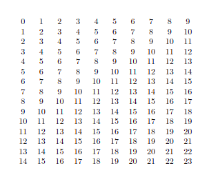

# Задача 2.1

**Note:** код, сгенерировавший артефакты был изменён. Код, соответсвующий заданию 2.1 можно найти
в [этой старой версии репозитория](https://github.com/Seva-Vaskin/python-homeworks/tree/0f3d42733e992037bb855af08ee735309f126409/hw_2)

[Файл с LaTeX кодом](task_2_1_table.tex) был сгенерирован следующей командой:

` python hw_2/generate_table.py 15 10 >hw_2/artifacts/task_2_1_table.tex`

Скриншот скомпилированной таблицы из overleaf:



# Задача 2.2

Файлы [task_2_2.tex](task_2_2.tex) и [task_2_2.pdf](task_2_2.pdf) были сгенерированы следующими командами
соответственно:

```
python hw_2/generate_tex_file.py 4 7 hw_2/artifacts/example_image.png >hw_2/artifacts/task_2_2.tex
```

```
pdflatex hw_2/artifacts/task_2_2.tex
```

Собранный пакет можно найти по [этой ссылке](https://pypi.org/project/latex-generator-test/)

# Задача 2.3

[Dockerfile](../Dockerfile)